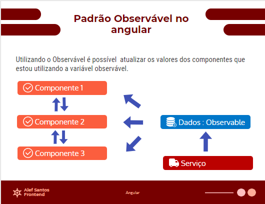

# Angular CLI Template

This template was generated with [Angular CLI](https://github.com/angular/angular-cli).

## Running `ng` commands

On the terminal on your bottom right there is a + you can click to open a new tab in it you can write any commands you want with:

```
yarn ng <your command>
```
# Angular

# Variável observável com angular

> OBS: É necessário ter um conhecimento prévio do angular para prosseguir
> 

**Oque é o padrão Observável?**  
É um padrão que vai permitir a observação do estado de uma variável. Com isso toda vez que essa variável mudar o seu estado o componente pai, filho ou irmão vai saber.



**Implementação**

Crie um arquivo chamado **observable.service.ts** dentro da pasta Service.

O a pasta pode ser criada através do CLI do angular, utilizando o comando:

```bash
npm ng g service observable
```

```bash
import { Injectable } from '@angular/core';
import { Subject } from 'rxjs';

@Injectable({
  providedIn: 'root'
})
export class ObservableService {
  public dados: Subject<string> = new Subject<string>();

  public setDados(dados: string) { 
    this.dados.next(dados);
  }

  public getDados()  {
    this.dados.asObservable()
  }

  constructor() { }
}
```

Após criar o service, você pode utiliza-lo em vários componentes, injetando uma dependência pelo construtor.

Para criar um mini componente, para ver como funciona o observer na prática digite o seguinte comando em seu terminal.

```bash
npm ng g component components/pai
```

No arquivo pai.component.html adicione o seguinte código

```html
<div class="conteudo">
  <div id="cabecalho">
    <h1>{{ title }}</h1>
  </div>
  <div id="conteudo-principal">
    <div id="principal">
      <h3 style="color: white;">{{ descricao }}</h3>
    </div>
    <div id="secundario">
      <app-filho></app-filho>
      <app-irmao></app-irmao>
    </div>
  </div>
  <div id="rodape" style="color: white">
    {{ dados }}
  </div>
</div>
```

No arquivo pai.component.ts adicione o seguinte código

```tsx
export class PaiComponent implements OnInit {
  public title: string = "Componente Pai";
  public descricao: string = "Conteúdo da div pai";
  public dados: string =  '';

  constructor(private observableService: ObservableService) {
    this.observableService.dados.subscribe(observer => this.dados = observer);
  }

  ngOnInit(): void {}
}
```

**Note que essa é a parte do código que injeta o** observableService, possibilitando sempre a atualização da variável dados.

Agora, vamos criar um componente que vai mudar o estado dessa variável, abaixo esta o html e o typescript desse segundo componente.

filho.component.html

```html
<div class="conteudo in-component">
  <div id="cabecalho">
    <h1>{{ title }}</h1>
  </div>
  <div id="conteudo-principal">
    <div id="principal">
      <h3>{{ descricao }}</h3>
    </div>
    <div id="secundario">
      <button (click)="mudarEstadoObservable()">Mudar descrição</button>
    </div>
  </div>
  <div id="rodape">
    {{ dados }}
  </div>
</div>
```

filho.component.ts

```tsx
import { Component, OnInit } from "@angular/core";
import { ObservableService } from "src/app/services/observable.service";

@Component({
  selector: "app-filho",
  templateUrl: "./filho.component.html",
  styleUrls: ["./filho.component.css"]
})
export class FilhoComponent implements OnInit {
  public title: string = "Filho";
  public descricao: string = "Sou um Componente "+ this.title;
  public dados: string = '';

  constructor(private observable: ObservableService) {
    this.observable.dados.subscribe(observer => {
      this.dados = observer;
    })
  }

  public mudarEstadoObservable(): void { 
    this.observable.setDados(this.descricao)
  }

  ngOnInit(): void {}
}
```

Note que no construtor, também ´é utilizado o observable, pois vamos atualizar a variavel dados desse componente.

Para mudar o estado da variável, foi criado um método chamado mudarEstadoObservable(), que seta o valor antigo do Service, para um novo valor.

Caso queira estilizar com algum css, no CSS global da sua aplicação adicione a seguinte linha de css

styles.css

```css
@import url("https://fonts.googleapis.com/css2?family=Alfa+Slab+One&family=Roboto:wght@300;400;500&display=swap");

* {
  margin: 0;
  padding: 0;
  box-sizing: border-box;
  font-family: "Roboto", sans-serif;
}

.conteudo {
  background-color: rgb(14, 14, 14);
  min-height: 100vh;
  width: 100%;
  display: flex;
  flex-direction: column;
  justify-content: center;
  align-items: center;
}

.conteudo.in-component {
  background-color: white;
  min-height: 330px;
  width: 200px;
  margin: 14px;
}

.conteudo #cabecalho {
  height: 55px;
}

.conteudo #cabecalho h1 {
  color: #ccc;
  padding: 10px 5vw;
  font-family: "Alfa Slab One", cursive;
  font-weight: 300;
}

.conteudo #conteudo-principal {
  width: 100%;
  display: flex;
  justify-content: center;
  flex-direction: column;
  align-content: center;
}

.conteudo #conteudo-principal #principal {
  margin-top: 15px;
  text-align: center;
}

.conteudo #conteudo-principal #secundario {
  display: flex;
  justify-content: center;
  flex-wrap: wrap;
  align-items: center;
  margin: 20px 0;
}

button {
	width: 62%;
	height: 30px;
	cursor: pointer;
	border: none;
	display: flex;
	align-items: center;
	justify-content: center;
	background-color: #a099a05c;
	background-size: 200% 100%;
	background-position: left;
	background-repeat: no-repeat;
	transition: 500ms;
  color: rgb(30, 29, 29);
}
```